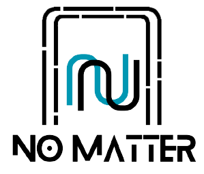
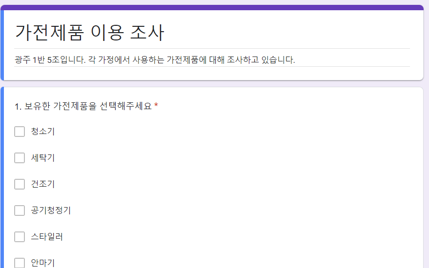

## 누구나 쉽게, 스마트 홈의 완성

## 서비스 소개
NoMatter는 오래된 가전제품을 최신형 기기와 같이 원격 및 음성 제어 기능을 가능하게 합니다. 또한, 스케줄링 기능을 제공하여 자신의 생활 패턴에 맞춰 편리한 가전 제어 서비스를 제공합니다.

## 프로젝트 소개
SSAFY 9기 공통 프로젝트
23.07 ~ 23.08(6주)
총 6명 (프론트 3 / 백 1 / 임베디드 2)

## 기술 스택
- Front-end 

- Back-end

- HardWare

- 협업

## 개발 환경
***FE*** React 16.13.0 / PWA

***BE*** Spring-Boot 2.7.14 / MariaDB

***HW*** ubuntu 22.04 LTS / Raspberry Pi 4 Model B

## 프로젝트 특징

#### 1. 설문

- 설문을 진행하여 서비스의 필요성과 이용 가능성에 대해 조사하여, NoMatter 서비스의 제작 배경을 확인했습니다.

#### 2. 웹앱
- PWA(Progressive Web App)을 이용하여 모바일 환경에서도 서비스 사용이 가능하도록 제작하였습니다.

#### 3. 블루투스 연결 & 와이파이 연결
- 별도의 HW 서버없이 허브와 스마트폰을 블루투스 연결을 이용하여 와이파이에 대한 정보를 제공하도록 하였습니다.

#### 4. 루틴 설정
- 스케줄/날씨/명령어를 통해 자신이 원하는 시간/날씨/명령어에 따라 서비스가 동작하도록 하였습니다.

#### 5. 음성 인식
- 'NoMatter' 명령어 인식 시 명령어 루틴을 사용할 수 있도록 명령을 인식하여 서비스를 사용할 수 있도록 하였습니다.

[//]: # (#### 6. Special Thanks)

[//]: # (- Back End와 배포를 맡아준 "이도하"님에게 감사를 표합니다)

## 서비스 화면 및 기능 소개
- [랜딩 페이지](https://lab.ssafy.com/s09-webmobile3-sub2/S09P12C105/-/blob/develop/introdcution/LandingPage.md)
- [회원가입 및 로그인](https://lab.ssafy.com/s09-webmobile3-sub2/S09P12C105/-/blob/develop/introdcution/LoginSignUp.md)
- [비밀번호 변경 및 회원 탈퇴](https://lab.ssafy.com/s09-webmobile3-sub2/S09P12C105/-/blob/develop/introdcution/MemberModify.md)
- [메인 페이지](https://lab.ssafy.com/s09-webmobile3-sub2/S09P12C105/-/blob/develop/introdcution/MainPage.md)
- [허브 페이지](https://lab.ssafy.com/s09-webmobile3-sub2/S09P12C105/-/blob/develop/introdcution/HubPage.md)
- [루틴 페이지](https://lab.ssafy.com/s09-webmobile3-sub2/S09P12C105/-/blob/develop/introdcution/RoutinePage.md)

## 프로젝트 관련 문서
#### <a href="https://lab.ssafy.com/s09-webmobile3-sub2/S09P12C105/-/blob/develop/img/SW%20%EC%95%84%ED%82%A4%ED%85%8D%EC%B2%98%20%EB%8B%A4%EC%9D%B4%EC%96%B4%EA%B7%B8%EB%9E%A8.jpg">아키텍처 보러가기</a>
#### <a href="https://lab.ssafy.com/s09-webmobile3-sub2/S09P12C105/-/blob/develop/img/%EA%B8%B0%EB%8A%A5%EB%AA%85%EC%84%B8%EC%84%9C.png">기능명세서 보러가기</a>
#### <a href="https://lab.ssafy.com/s09-webmobile3-sub2/S09P12C105/-/blob/develop/img/erd.png">ERD 보러가기</a>